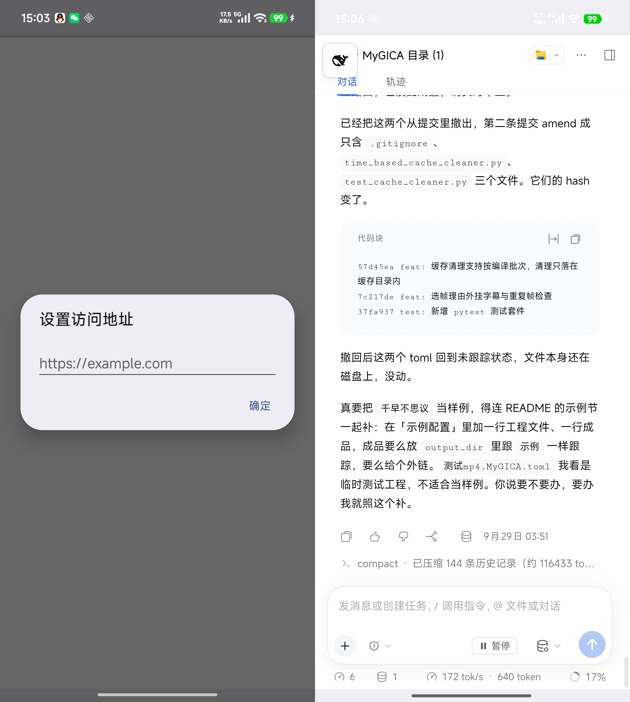

# DSH

[](https://github.com/better-er/mi14-webview/actions/workflows/build.yml) [](LICENSE)

把自建站点包成一个安卓应用的极简外壳，界面就是系统 WebView 本身。本仓库是个人自用工具，与 DeepSeek Harness 官方项目无关。



## 它能解决什么

自建服务搬到手机上常遇到三件麻烦事，这个壳都处理掉了：

- 地址配置：首次启动填一次站点地址，之后直接进站点，要换站点在证书弹窗里点「换地址」。
- 自签名证书：系统 WebView 默认拦截，确认一次后记住。
- HTTP Basic 认证：WebView 自己不弹登录框，这里弹一次并记住用户名密码。

除此之外没有多余东西，没有广告、没有统计、没有后台服务，也没有第三方依赖，只用系统 WebView 与系统对话框。

## 安装

从 [Releases](https://github.com/better-er/mi14-webview/releases) 下载 apk，在手机上打开安装。

用 adb 安装：

```sh
adb install -r dsh-1.0.apk
```

小米 HyperOS 上若报 INSTALL_FAILED_USER_RESTRICTED，是手机上的安装确认被取消了，重试并点继续即可。流式安装失败时改用文件方式，同样要在手机上确认：

```sh
adb push dsh-1.0.apk /data/local/tmp/dsh.apk
adb shell pm install -r /data/local/tmp/dsh.apk
```

## 构建

不需要 Gradle，构建脚本直接调用 SDK 里的 aapt2、javac、d8、zipalign、apksigner。需要 Android SDK 的 platform 36 与 build-tools 36.0.0，以及 JDK 17 以上。脚本按命令行参数、`ANDROID_SDK_ROOT`、`JAVA_HOME` 的顺序取路径，都没有才回退到本机默认值。

Windows：

```powershell
pwsh -File build.ps1
```

Linux 与 macOS：

```sh
bash build.sh
```

产物是 `dist/dsh-<版本名>.apk`，默认用调试密钥签名，装完即用。

想给固定站点出一个定制包，把地址填进 `FALLBACK_URL`，位置在 `app/src/main/java/com/xiangyun/dshmobile/MainActivity.java`，留空则由用户首次启动时填写。

## 发布

版本号由参数注入，不再写死在清单里：

```powershell
pwsh -File build.ps1 -VersionCode 2 -VersionName 1.1
```

正式分发要用自己的密钥库，由 `tools\gen-keystore.ps1` 生成，默认落在 `keystore\release.keystore`，该目录不会进版本库。它会随机生成一个口令并写进同目录的 `password.txt`，请连同密钥库一起备份到仓库外，私钥丢失后无法覆盖升级已经发布的包。

```powershell
pwsh -File tools\gen-keystore.ps1
pwsh -File build.ps1 -VersionCode 2 -VersionName 1.1 -Keystore keystore\release.keystore -KsAlias release -KsPass 口令
```

推送 `v` 开头的标签会触发 `.github/workflows/build.yml`，自动构建并把 apk 挂到 Release。仓库配置 `KEYSTORE_BASE64`、`KEY_ALIAS`、`KEY_PASSWORD` 三个 Secret 就用它签名，没配置则退回临时调试密钥。

## 应用信息

| 项 | 值 |
| --- | --- |
| 包名 | com.xiangyun.dshmobile |
| 版本 | 1.0 |
| minSdk | 26 |
| targetSdk | 36 |
| 体积 | 约 20 KB |
| 图标 | VectorDrawable，矢量绘制，任意尺寸都清晰 |

## 名称与图标

应用名 DSH 与鲸鱼图标来自 DeepSeek Harness 项目，本项目只是个人自用的手机端外壳，与该项目没有从属关系。

## 许可

[MIT](LICENSE)
